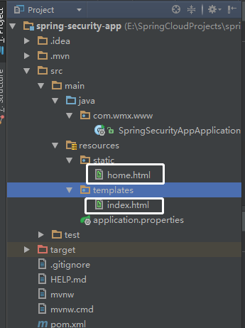
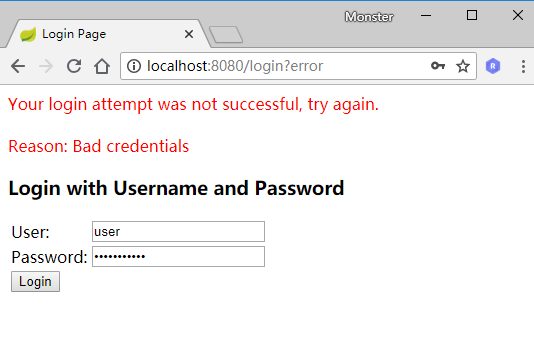
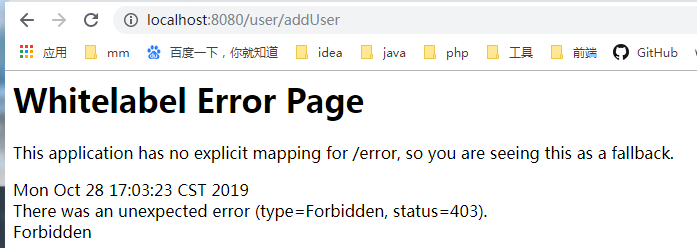

# Spring Security 详细简绍与入门
- 1、Java web 应用中安全框架使用率高的莫过于：

> spring-security：[https://spring.io/projects/spring-security](https://spring.io/projects/spring-security)
>
> Apache Shiro ：[http://shiro.apache.org/](http://shiro.apache.org/)

- 2、Spring Security 是 Spring 官网的顶级项目，与 spring boot、spring data、spring cloud 等齐名。

- 3、Spring Security 是一个专注于向 Java 应用程序提供身份验证和授权的安全框架，与所有 Spring 项目一样，Spring Security 的真正威力在于它可以很容易地扩展以满足定制需求。

> Spring Security is a framework that focuses on providing both authentication and authorization to Java applications. Like all Spring projects, the real power of Spring Security is found in how easily it can be extended to meet custom requirements

- 4、Spring Security 是 Spring Boot 底层安全模块默认的技术选型，可以实现强大的 web 安全控制，对于安全控制，仅需引入spring-boot-starter-security 模块，进行少量的配置，即可实现强大的安全管理。

## Features（特性）
- 1）Comprehensive and extensible support for both Authentication and Authorization（全面和可扩展的身份验证和授权支持）

- 2）Protection against attacks like session fixation, clickjacking, cross site request forgery, etc（防止攻击，如会话固定，点击劫持，跨站请求伪造等）

- 3）Servlet API integration（Servlet API的集成）

- 4）Optional integration with Spring Web MVC （与Spring Web MVC的可选集成）

## 认证 & 授权
- 1、应用程序安全的两个主要区域是“认证”和“授权”，spring security 的主要核心功能也是认证和授权。

### 认证（Authentication）

> 用户认证指的是验证某个用户是否为系统中的合法主体，即用户能否访问该系统。用户认证一般要求用户提供账号和密码，系统通过校验账号和密码来完成认证过程。

### 授权（Authorization）

> 用户授权指的是验证某个用户是否有权限执行某个操作。在一个系统中，不同用户所具有的权限通常是不同的，以一个为例，有的用户只能读，有的用户能读能写。一般来说，系统会为不同的用户分配不同的角色，而每个角色则对应一系列的权限。  
## Web & 安全
- 1、登陆/注销

-HttpSecurity 配置登陆、注销功能

- 2、Thymeleaf 提供 SpringSecurity 标签支持

–需要引入thymeleaf-extras-springsecurity4

–sec:authentication=“name”获得当前用户的用户名

–sec:authorize=“hasRole(‘ADMIN’)”当前用户必须拥有ADMIN权限时才会显示标签内容

- 3、remember me

–表单添加 remember-me 的 checkbox

–配置启用 remember-me 功能

- 4、CSRF（Cross-site request forgery）跨站请求伪造

-HttpSecurity 启用 csrf 功能，会为表单添加 _csrf 的值，提交携带来预防 CSRF
## 框架内容

> 众所周知 想要对对Web资源进行保护，最好的办法莫过于Filter，要想对方法调用进行保护，最好的办法莫过于AOP。所以springSecurity在我们进行用户认证以及授予权限的时候，通过各种各样的拦截器来控制权限的访问，从而实现安全。  

如下为其主要过滤器   
 
- WebAsyncManagerIntegrationFilter   
* SecurityContextPersistenceFilter   
* HeaderWriterFilter   
* CorsFilter 
* LogoutFilter
* RequestCacheAwareFilter
* SecurityContextHolderAwareRequestFilter
* AnonymousAuthenticationFilter
* SessionManagementFilter
* ExceptionTranslationFilter
*  FilterSecurityInterceptor
* UsernamePasswordAuthenticationFilter
* BasicAuthenticationFilter

框架的核心组件
* SecurityContextHolder：提供对SecurityContext的访问
* SecurityContext,：持有Authentication对象和其他可能需要的信息
* AuthenticationManager 其中可以包含多个AuthenticationProvider
* ProviderManager对象为AuthenticationManager接口的实现类
* AuthenticationProvider 主要用来进行认证操作的类 调用其中的authenticate()方法去进行认证操作
* Authentication：Spring Security方式的认证主体
* GrantedAuthority：对认证主题的应用层面的授权，含当前用户的权限信息，通常使用角色表示
* UserDetails：构建Authentication对象必须的信息，可以自定义，可能需要访问DB得到
* UserDetailsService：通过username构建UserDetails对象，通过loadUserByUsername根据userName获取 UserDetail对象 （可以在这里基于自身业务进行自定义的实现  如通过数据库，xml,缓存获取等）    

## run
### 1. 添加依赖
```
<dependency>
    <groupId>org.springframework.boot</groupId>
    <artifactId>spring-boot-starter-security</artifactId>
</dependency>
```
- 1、当没有导入 spring security 组件时，4大静态资源目录下的资源以及 templates 下的 index.html 都可以从浏览器直接访问，但是一旦导入就无法直接访问了。

- 2、spring security 导入后默认已经开启了验证，必须先登录验证通过后才能访问，当不做任何配置时，security 提供默认的账号为 `user`、登录的密码在应用启动时会随机生成并打印在控制台，格式如下所示：
> Using generated security password: d4d1ce0a-4594-4287-b843-49fc9137fc41
### 新建页面与默认账号访问测试
- 1、Spring boot 应用默认情况下如下所示的 4 大静态资源目录下的资源，浏览器都可以直接访问。

>"classpath:/META‐INF/resources/",
"classpath:/resources/",
"classpath:/static/",
"classpath:/public/"
- 2、4 大静态资源目录下 .html 文件中无法使用 Thyemelaf 模板引擎，templates 模板目录下 .html 文件中可以使用。

- 3、templates 模板目录中的 .html 文件除了 index.html 可以直接访问外，其余的从浏览器都无法直接访问，必须通过后台才能访问，相当于以前的 WEB-INF目录下的文件无法直接访问一样。

- 4、现在在 resources/templates 下新建 index.html 页面，在 resources/static 下面新建 home.html，其余内容都默认。

- 5、下面启动 web 应用，可以在控制台看到如下信息：

6、如下所示当用户未登录时，访问`http://localhost:8080/home.html`会自动跳转到 Security 的 /login 进行登录操作，登录错误时会自动跳转到 /login?error，这些都是 Security 集成好了的。
## application.yml 自定义默认账号与密码
- 1、上面未做任何配置时 spring security 使用的默认账号 `user`，密码是启动时随机生成的，现在在全局配置文件中对它们进行修改。

- 2、在 spring boot 2.1.3 官网中可以找到如下 SECURITY PROPERTIES 配置项：
```
# ----------------------------------------
# SECURITY PROPERTIES
# ----------------------------------------
# SECURITY (SecurityProperties)
spring.security.filter.order=-100 # Security filter chain order.
spring.security.filter.dispatcher-types=async,error,request # Security filter chain dispatcher types.
spring.security.user.name=user # Default user name.默认用户名为 user
spring.security.user.password= # Password for the default user name. 账号的密码，默认是自动随机生成
spring.security.user.roles= # Granted roles for the default user name. 默认用户角色
 
# SECURITY OAUTH2 CLIENT (OAuth2ClientProperties)
spring.security.oauth2.client.provider.*= # OAuth provider details.
spring.security.oauth2.client.registration.*= # OAuth client registrations.
 
# SECURITY OAUTH2 RESOURCE SERVER (OAuth2ResourceServerProperties)
spring.security.oauth2.resourceserver.jwt.jwk-set-uri= # JSON Web Key URI to use to verify the JWT token.
   spring.security.oauth2.resourceserver.jwt.issuer-uri= # URI that an OpenID Connect Provider asserts as its Issuer Identifier.
```
3、现在在 application.properties 文件配置如下（application.yml 也是同理）：
```
#应用上下文路径
server.servlet.context-path=/
#服务器访问端口
server.port=80
#spring security 安全认证的默认账号与密码
spring.security.user.name=admin
spring.security.user.password=123456
```
4、再次启动应用进行访问：

5、此时必须使用配置好的账号与密码登录。
## 基于表单的认证
-- 简单的配置
```
@Override
protected void configure(HttpSecurity http) throws Exception {
    // http.formLogin() // 表单方式
    http.httpBasic() // HTTP Basic方式
            .and()
            .authorizeRequests() // 授权配置
            .anyRequest()  // 所有请求
            .authenticated(); // 都需要认证
}
```

## 基本原理
上面我们开启了一个最简单的Spring Security安全配置，下面我们来了解下Spring Security的基本原理。通过上面的的配置，代码的执行过程可以简化为下图表示：

如上图所示，Spring Security包含了众多的过滤器，这些过滤器形成了一条链，所有请求都必须通过这些过滤器后才能成功访问到资源。其中UsernamePasswordAuthenticationFilter过滤器用于处理基于表单方式的登录认证，而BasicAuthenticationFilter用于处理基于HTTP Basic方式的登录验证，后面还可能包含一系列别的过滤器（可以通过相应配置开启）。在过滤器链的末尾是一个名为FilterSecurityInterceptor的拦截器，用于判断当前请求身份认证是否成功，是否有相应的权限，当身份认证失败或者权限不足的时候便会抛出相应的异常。ExceptionTranslateFilter捕获并处理，所以我们在ExceptionTranslateFilter过滤器用于处理了FilterSecurityInterceptor抛出的异常并进行处理，比如需要身份认证时将请求重定向到相应的认证页面，当认证失败或者权限不足时返回相应的提示信息。


## 内存用户认证与授权
### UserControler 控制层访问
- 1、实际中不可能直接访问 .html 文件，而是通过后台控制器处理后进行跳转或者返回，这里新建一个 UserControler，提供增删改查的四个方法来从浏览器访问。方法中只做简单模拟，并不操作数据库。

```
package cn.andyoung.springsecurity.controller;

import org.springframework.web.bind.annotation.GetMapping;
import org.springframework.web.bind.annotation.PathVariable;
import org.springframework.web.bind.annotation.RequestMapping;
import org.springframework.web.bind.annotation.RestController;

@RestController
@RequestMapping("user")
public class UserController {
  @GetMapping("addUser")
  public String addUser() {
    return "添加用户成功：" + System.currentTimeMillis();
  }

  @GetMapping("deleteUser/{uid}")
  public String deleteUser(@PathVariable(name = "uid") Integer uid) {
    return "删除用户成功：uid=" + uid;
  }

  @GetMapping("updateUser")
  public String updateUser() {
    return "修改用户成功：" + System.currentTimeMillis();
  }

  @GetMapping("findAllUsers")
  public String findAllUsers() {
    return "查询用户成功：" + System.currentTimeMillis();
  }
}

```
- 2、浏览访问路径如下，此时未配置用户与角色时，默认用户 admin 登录后，这些方法都可以正常访问。

>http://localhost/user/addUser
http://localhost/user/deleteUser/101
http://localhost/user/updateUser
http://localhost/user/findAllUsers

### 认证与授权配置
> 1、自定义类实现 org.springframework.security.config.annotation.web.configuration.WebSecurityConfigurerAdapter，然后重写方法配置认证与授权。

> 2、@EnableWebSecurity 开启安全认证与授权，详细信息已经在注释中说明。
```
package cn.andyoung.springsecurity.config;

import org.springframework.security.config.annotation.authentication.builders.AuthenticationManagerBuilder;
import org.springframework.security.config.annotation.web.builders.HttpSecurity;
import org.springframework.security.config.annotation.web.configuration.EnableWebSecurity;
import org.springframework.security.config.annotation.web.configuration.WebSecurityConfigurerAdapter;
import org.springframework.security.crypto.password.PasswordEncoder;

@EnableWebSecurity // 表示开启 Spring Security 安全认证与授权
public class SecurityConfig extends WebSecurityConfigurerAdapter {
  /**
   * 定义用户认证规则
   *
   * @param auth
   * @throws Exception
   */
  @Override
  protected void configure(AuthenticationManagerBuilder auth) throws Exception {
    /**
     * inMemoryAuthentication()：添加内存用户认证(InMemoryUserDetailsManagerConfigurer)，这些账号密码都会存储在内存中，而不是数据库，所以同理还有-
     * jdbcAuthentication()：JdbcUserDetailsManagerConfigurer 数据库用户认证 passwordEncoder(PasswordEncoder
     * passwordEncoder)：密码编码，Spring Security 高版本必须进行密码编码，否则报错 UserDetailsBuilder withUser(String
     * username)：添加用户 UserDetailsBuilder password(String password)：为用户添加密码，不能为 null
     * UserDetailsBuilder roles(String... roles)：为用户添加角色 C and()：返回对象，方便链式编程，也可以分开写
     */
    auth.inMemoryAuthentication()
        .passwordEncoder(new MyPasswordEncoder())
        .withUser("ZhangSan")
        .password("123456")
        .roles("topLevel")
        .and()
        .withUser("guoJing")
        .password("123456")
        .roles("senior")
        .and()
        .withUser("yangGuo")
        .password("123456")
        .roles("middleRank", "primary")
        .and()
        .withUser("weiXiaoBao")
        .password("123456")
        .roles("primary");
  }

  @Override
  public void configure(HttpSecurity http) throws Exception {
    /**
     * authorizeRequests：表示验证请求 antMatchers(String... antPatterns)：使用
     * org.springframework.security.web.util.matcher.AntPathRequestMatcher 的匹配规则
     * permitAll()：允许一切用户访问，底层也是调用 access("permitAll") hasRole(String role)：url请求允许访问的角色
     * hasAnyRole(String... roles) : url请求允许访问的多个角色 access(String
     * attribute)：允许访问的角色，permitAll、hasRole、hasAnyRole 底层都是调用 access 方法 access("permitAll") 等价于
     * permitAll()
     */
    http.authorizeRequests().antMatchers("/").permitAll(); // "/"：应用首页所以用户都可以访问
    http.authorizeRequests()
        .antMatchers("/user/addUser")
        .hasRole("topLevel") // 首斜杠"/"表示应用上下文,/user/addUser 请求允许 topLevel 角色访问
        .antMatchers("/user/deleteUser/**")
        .hasAnyRole(
            "topLevel", "senior") // "/user/deleteUser/**"允许 "topLevel", "senior" 角色访问，/**匹配任意
        .antMatchers("/user/updateUser")
        .hasAnyRole("topLevel", "senior", "middleRank") // 除了这种链式编程，也可以分开写
        .antMatchers("/user/findAllUsers")
        .access("permitAll");

    /**
     * http.authorizeRequests().anyRequest().hasRole("senior")： 表示上面约定以外的所有请求，都需要有 senior 角色才可以访问
     * http.authorizeRequests().anyRequest().authenticated()：
     * 表示上面约定以外的所有请求，必须要经过认证才能访问，但是认证的可以是任意角色，即只要认证就行，与角色的权限无关
     */
    //        http.authorizeRequests().anyRequest().hasRole("senior");
    http.authorizeRequests().anyRequest().authenticated();

    /**
     * formLogin：指定支持基于表单的身份验证 未使用 FormLoginConfigurer#loginPage(String)
     * 指定登录页时，将自动生成一个登录页面，亲测此页面引用的是联网的 bootstarp 的样式，所以断网时，样式会有点怪 当用户没有登录、没有权限时就会自动跳转到登录页面(默认
     * /login) 当登录失败时，默认跳转到 /login?error 登录成功时会放行
     */
    http.formLogin();
  }

  class MyPasswordEncoder implements PasswordEncoder {
    @Override
    public String encode(CharSequence charSequence) {
      return charSequence.toString();
    }

    @Override
    public boolean matches(CharSequence charSequence, String s) {
      return s.equals(charSequence.toString());
    }
  }
}
```
1、此时再次启动应用时：

> zhangWuJi 可以访问 addUser、deleteUser、updateUser、findAllUsers 方法
>
> guoJing 可以访问 deleteUser、updateUser、findAllUsers 方法
>
> yangGuo 可以访问 updateUser、findAllUsers 方法
>
> weiXiaoBao  可以访问 findAllUsers 方法
2、 使用`guoJing`登录访问`http://localhost:8080/user/addUser`


> Forbidden：不允许的，被禁止的。表示权限不足，这里因为没有配置错误页面，所以直接显示错误信息。