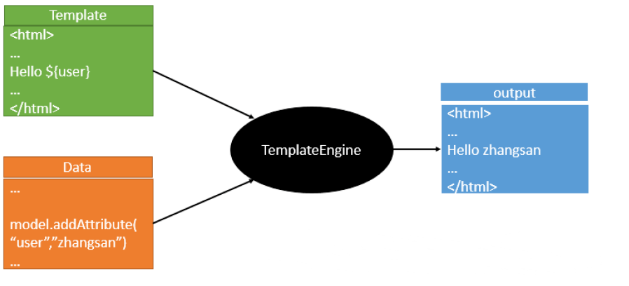

# Thymeleaf 模板引擎
- 1、Thymeleaf 是 Web 和独立环境的现代服务器端 Java 模板引擎，能够处理HTML，XML，JavaScript，CSS 甚至纯文本。

- 2、Thymeleaf 的主要目标是提供一种优雅和高度可维护的创建模板的方式。为了实现这一点，它建立在自然模板的概念上，将其逻辑注入到模板文件中，不会影响模板被用作设计原型。这改善了设计的沟通，弥补了设计和开发团队之间的差距。

- 3、Thymeleaf 也从一开始就设计了Web标准 - 特别是 HTML5 - 允许您创建完全验证的模板，Spring Boot 官方推荐使用  thymeleaf 而不是 JSP。

- 4、Thymeleaf 官网：https://www.thymeleaf.org/

- 5、Thymeleaf 在 Github 的主页：https://github.com/thymeleaf/thymeleaf

- 6、Spring Boot 中使用 Thymeleaf  模板引擎时非常简单，因为 Spring Boot 已经提供了默认的配置，比如解析的文件前缀，文件后缀，文件编码，缓存等等，程序员需要的只是写 html 中的内容即可。
## 模板引擎

1）市面上主流的 Java 模板引擎有：JSP、Velocity、Freemarker、Thymeleaf

2）JSP本质也是模板引擎，Spring Boot 官方推荐使用 “Thymeleaf”模板引擎

3）模板引擎原理图如下，模板引擎的作用都是将模板(页面)和数据进行整合然后输出显示，区别在于不同的模板使用不同的语法，如 JSP 的 JSTL 表达式，以及 JSP 自己的表达式和语法，同理 Thymeleaf 也有自己的语法

## 入门
- pox.xml
```
<dependency>
    <groupId>org.springframework.boot</groupId>
    <artifactId>spring-boot-starter-thymeleaf</artifactId>
</dependency>
```
- Controller
```
 /**
   * 全部基于 Spring Boot给 Thymeleaf的默认配置 所以下面会跳转到 classpath:/templates/home.html 页面
   *
   * @param paramMap
   * @return
   */
  @RequestMapping("home")
  public String goHome(Map<String, Object> paramMap) {
    /** 默认Map的内容会放大请求域中，页面可以直接使用Thymeleaf取值 */
    paramMap.put("name", "张三");
    paramMap.put("age", 35);
    return "home";
  }
```
- html
```
<!DOCTYPE html>
<html lang="en">
<head>
    <meta charset="UTF-8">
    <title>Home</title>
</head>
<body>
<h1>welcome to home</h1>
name:<span th:text="${name}">姓名</span>
<br>
age :<span th:text="${age}">年龄</span>
</body>
</html>
```
- 运行结果

