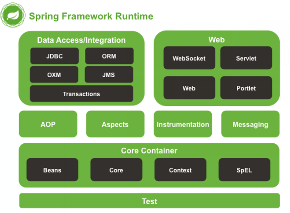

# spring

## 介绍
Spring 是分层的 Java SE/EE 应用 full-stack 轻量级开源框架，以 IoC（Inverse Of Control：
反转控制）和 AOP（Aspect Oriented Programming：面向切面编程）为内核，提供了展现层 Spring 
MVC 和持久层 Spring JDBC 以及业务层事务管理等众多的企业级应用技术，还能整合开源世界众多
著名的第三方框架和类库，逐渐成为使用最多的 Java EE 企业应用开源框架。
## 优势
### 方便解耦，简化开发
- 通过 Spring 提供的 IoC 容器，可以将对象间的依赖关系交由 Spring 进行控制，避免硬编码所造成的过度程序耦合。用户也不必再为单例模式类、属性文件解析等这些很底层的需求编写代码，可以更专注于上层的应用。
### AOP 编程的支持
- 通过 Spring 的 AOP 功能，方便进行面向切面的编程，许多不容易用传统 OOP 实现的功能可以通过 AOP 轻松应付。
### 声明式事务的支持
- 可以将我们从单调烦闷的事务管理代码中解脱出来，通过声明式方式灵活的进行事务的管理，提高开发效率和质量。
### 方便程序的测试
- 可以用非容器依赖的编程方式进行几乎所有的测试工作，测试不再是昂贵的操作，而是随手可做的事情。
### 方便集成各种优秀框架Spring 
- 可以降低各种框架的使用难度，提供了对各种优秀框架（Struts、Hibernate、Hessian、Quartz等）的直接支持。
### 降低 JavaEE API 的使用难度
- Spring 对 JavaEE API（如 JDBC、JavaMail、远程调用等）进行了薄薄的封装层，使这些 API 的使用难度大为降低。
### Java 源码是经典学习范例
- Spring 的源代码设计精妙、结构清晰、匠心独用，处处体现着大师对 Java 设计模式灵活运用以及对 Java 技术的高深造诣。它的源代码无意是 Java 技术的最佳实践的范例。

## spring 的体系结构



## spring 原理概念
参考
- [spring学习](https://www.cnblogs.com/wmyskxz/p/8820371.html)
- [原理概念](../doc/spring(一).pdf)

## spring xml配置
- bean.xml
```
<?xml version="1.0" encoding="UTF-8"?>
<beans xmlns="http://www.springframework.org/schema/beans"
       xmlns:xsi="http://www.w3.org/2001/XMLSchema-instance"
       xsi:schemaLocation="http://www.springframework.org/schema/beans
        http://www.springframework.org/schema/beans/spring-beans.xsd">

    <!--把对象的创建交给spring来管理-->
    <bean id="accountService" class="cn.andyoung.service.impl.AccountServiceImpl"></bean>

    <bean id="accountDao" class="cn.andyoung.dao.impl.AccountDaoImpl"></bean>
</beans>
```

#### run

```
package cn.andyoung;

import cn.andyoung.dao.IAccountDao;
import cn.andyoung.service.IAccountService;
import org.springframework.context.ApplicationContext;
import org.springframework.context.support.ClassPathXmlApplicationContext;

public class Spring {
    public static void main(String[] args){

        //1.使用 ApplicationContext 接口，就是在获取 spring 容器
        ApplicationContext ac = new ClassPathXmlApplicationContext("bean.xml");
        //2.根据 bean 的 id 获取对象
        IAccountService aService = (IAccountService) ac.getBean("accountService");
        System.out.println(aService);
        IAccountDao aDao = (IAccountDao) ac.getBean("accountDao");
        System.out.println(aDao);
    }
}
```

### IOC 中 bean 标签和管理对象细节
#### bean 标签
- 作用：
用于配置对象让 spring 来创建的。默认情况下它调用的是类中的无参构造函数。如果没有无参构造函数则不能创建成功。
- 属性：
 id：给对象在容器中提供一个唯一标识。用于获取对象。
 class：指定类的全限定类名。用于反射创建对象。默认情况下调用无参构造函数。
 scope：指定对象的作用范围。
 >* singleton :默认值，单例的.
 >* prototype :多例的.
 >* request :WEB 项目中,Spring 创建一个 Bean 的对象,将对象存入到 request 域中.
 >* session :WEB 项目中,Spring 创建一个 Bean 的对象,将对象存入到 session 域中.
 >* global session :WEB 项目中,应用在 Portlet 环境.如果没有 Portlet 环境那么globalSession 相当于 session.  

 - init-method：指定类中的初始化方法名称。
 - destroy-method：指定类中销毁方法名称。
#### bean 的作用范围和生命周期
##### 单例对象：scope="singleton"
一个应用只有一个对象的实例。它的作用范围就是整个引用。
生命周期：
- 对象出生：当应用加载，创建容器时，对象就被创建了。
- 对象活着：只要容器在，对象一直活着。
- 对象死亡：当应用卸载，销毁容器时，对象就被销毁了。
##### 多例对象：scope="prototype"
每次访问对象时，都会重新创建对象实例。
生命周期：
- 对象出生：当使用对象时，创建新的对象实例。
- 对象活着：只要对象在使用中，就一直活着。
- 对象死亡：当对象长时间不用时，被 java 的垃圾回收器回收了。
#### 实例化 Bean 的三种方式
- 第一种方式：使用默认无参构造函数
在默认情况下：
它会根据默认无参构造函数来创建类对象。如果 bean 中没有默认无参构造函数，将会创建失败。
```<bean id="accountDao" class="cn.andyoung.dao.impl.AccountDaoImpl"></bean>```
- 第二种方式：spring 管理静态工厂-使用静态工厂的方法创建对象
> 此种方式是:使用 StaticFactory 类中的静态方法 createAccountService 创建对象，并存入 spring 容器id 属性：指定 bean 的 id，用于从容器中获取class 属性：指定静态工厂的全限定类名factory-method 属性：指定生产对象的静态方法

```
public class StaticFactory {

    public static IAccountService getAccountService(){

        return new AccountServiceImpl();
    }
}

//bean.xml
<bean id="accountServiceStaticFactory"
    class="cn.andyoung.factory.StaticFactory"
    factory-method="getAccountService"></bean>

```
- 第三种方式：spring 管理实例工厂-使用实例工厂的方法创建对象
> 此种方式是：
先把工厂的创建交给 spring 来管理。
然后在使用工厂的 bean 来调用里面的方法
factory-bean 属性：用于指定实例工厂 bean 的 id。
factory-method 属性：用于指定实例工厂中创建对象的方法。

```
/**
* 模拟一个实例工厂，创建业务层实现类
* 此工厂创建对象，必须现有工厂实例对象，再调用方法
*/
public class InstanceFactory {

    public IAccountService getAccountService(){
        return new AccountServiceImpl();
    }
}

//bean.xml
<bean id="instancFactory" class="cn.andyoung.factory.InstanceFactory"></bean>
    <bean id="accountServiceInstancFactory" factory-bean="instancFactory" factory-method="getAccountService"></bean>
```

### spring 的依赖注入
#### 依赖注入的概念
- 依赖注入：Dependency Injection。它是 spring 框架核心 ioc 的具体实现。
- 我们的程序在编写时，通过控制反转，把对象的创建交给了 spring，但是代码中不可能出现没有依赖的情况。
ioc 解耦只是降低他们的依赖关系，但不会消除。例如：我们的业务层仍会调用持久层的方法。
- 那这种业务层和持久层的依赖关系，在使用 spring 之后，就让 spring 来维护了。
- 简单的说，就是坐等框架把持久层对象传入业务层，而不用我们自己去获取。
#### 构造函数注入

顾名思义，就是使用类中的构造函数，给成员变量赋值。注意，赋值的操作不是我们自己做的，而是通过配置的方式，让 spring 框架来为我们注入。具体代码如下：
```
public class AccountServiceImpl implements IAccountService {

    private String name;
    private Integer age;
    private Date birthday;

    public AccountServiceImpl(String name, Integer age, Date birthday) {
        this.name = name;
        this.age = age;
        this.birthday = birthday;
    }

    public AccountServiceImpl(){
        System.out.println("对象创建了");
    }

    public void  saveAccount(){
        accountDao.saveAccount();
    }
}
```
> 使用构造函数的方式，给 service 中的属性传值
要求：
> - 类中需要提供一个对应参数列表的构造函数。
涉及的标签：
> - constructor-arg
>    属性：
> index:指定参数在构造函数参数列表的索引位置
> type:指定参数在构造函数中的数据类型
> name:指定参数在构造函数中的名称 用这个找给谁赋值
=======上面三个都是找给谁赋值，下面两个指的是赋什么值的==============
value:它能赋的值是基本数据类型和 String 类型
ref:它能赋的值是其他 bean 类型，也就是说，必须得是在配置文件中配置过的 bean
```
<bean id="accountServiceC" class="cn.andyoung.service.impl.AccountServiceImpl">
        <constructor-arg name="name" value="张三"></constructor-arg>
        <constructor-arg name="age" value="18"></constructor-arg>
        <constructor-arg name="birthday" ref="now"></constructor-arg>
    </bean>
<bean id="now" class="java.util.Date"></bean>
```

#### set 方法注入
>顾名思义，就是在类中提供需要注入成员的 set 方法。具体代码如下：
```
 public void setAge(Integer age) {
        this.age = age;
}

public void setName(String name) {
        this.name = name;
}

public Date getBirthday() {
        return birthday;
}
```
> 通过配置文件给 bean 中的属性传值：使用 set 方法的方式
涉及的标签：
> - property属性：name：找的是类中 set 方法后面的部分
> - ref：给属性赋值是其他 bean 类型的
> - value：给属性赋值是基本数据类型和 string 类型的
>
>实际开发中，此种方式用的较多。
```
<bean id="accountServiceP" class="cn.andyoung.service.impl.AccountServiceImpl">
        <property name="name" value="test"></property>
        <property name="age" value="21"></property>
        <property name="birthday" ref="now"></property></bean>
```
#### 使用 p 名称空间注入数据（本质还是调用 set 方法）
> 此种方式是通过在 xml 中导入 p 名称空间，使用 p:propertyName 来注入数据，它的本质仍然是调用类中的
set 方法实现注入功能。
bean.xml 添加熟悉```xmlns:p="http://www.springframework.org/schema/p"```
```
<bean id="accountServiceP" class="cn.andyoung.service.impl.AccountServiceImpl">
        <p:name="name" value="test"></property>
        <p: name="age" value="21"></property>
        <p: name="birthday" ref="now"></property>
</bean>
```

#### 注入集合属性
> 顾名思义，就是给类中的集合成员传值，它用的也是set方法注入的方式，只不过变量的数据类型都是集合。
我们这里介绍注入数组，List,Set,Map,Properties。具体代码如下：
```
public class AccountDaoImpl implements IAccountDao {

    private String[] myStrs;
    private List<String> myList;
    private Set<String> mySet;
    private Map<String,String> myMap;
    private Properties myProps;

    public void setMyStrs(String[] myStrs) {
        this.myStrs = myStrs;
    }

    public void setMyList(List<String> myList) {
        this.myList = myList;
    }

    public void setMySet(Set<String> mySet) {
        this.mySet = mySet;
    }

    public void setMyMap(Map<String, String> myMap) {
        this.myMap = myMap;
    }
    public void setMyProps(Properties myProps) {
        this.myProps = myProps;
    }
}
```
> 注入集合数据
> - List 结构的：
array,list,set
> - Map 结构的
map,entry,props,prop
```
 <!-- 注入集合属性 -->
    <bean id="accountDaoCC" class="cn.andyoung.dao.impl.AccountDaoImpl">
<!-- 在注入集合数据时，只要结构相同，标签可以互换 --><!-- 给数组注入数据 -->
    <property name="myStrs">
        <set>
            <value>AAA</value>
            <value>BBB</value>
            <value>CCC</value>
        </set>
    </property>
        <!-- 注入 list 集合数据 -->
        <property name="myList">
            <array>
                <value>AAA</value>
                <value>BBB</value>
                <value>CCC</value>
            </array>
        </property>
        <!-- 注入 set 集合数据 -->
        <property name="mySet">
            <list><value>AAA</value>
                <value>BBB</value>
                <value>CCC</value>
            </list></property>
        <!-- 注入 Map 数据 -->
        <property name="myMap">
            <props>
                <prop key="testA">aaa</prop>
                <prop key="testB">bbb</prop>
            </props>
        </property>
    </bean>
```

