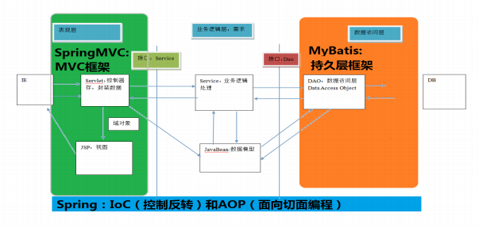

# Spring MVC的基本感念
## 关于三层架构和 MVC
### 三层架构
- 我们的开发架构一般都是基于两种形式，一种是 C/S 架构，也就是客户端/服务器，另一种是 B/S 架构，也就
是浏览器服务器。在 JavaEE 开发中，几乎全都是基于 B/S 架构的开发。那么在 B/S 架构中，系统标准的三层架构
包括：表现层、业务层、持久层。三层架构在我们的实际开发中使用的非常多，所以我们课程中的案例也都是基于
- 三层架构设计的。
三层架构中，每一层各司其职，接下来我们就说说每层都负责哪些方面：
  - 表现层：
也就是我们常说的web层。它负责接收客户端请求，向客户端响应结果，通常客户端使用http协议请求
web 层，web 需要接收 http 请求，完成 http 响应。
表现层包括展示层和控制层：控制层负责接收请求，展示层负责结果的展示。
表现层依赖业务层，接收到客户端请求一般会调用业务层进行业务处理，并将处理结果响应给客户端。
表现层的设计一般都使用 MVC 模型。（MVC 是表现层的设计模型，和其他层没有关系）
  - 业务层：
也就是我们常说的 service 层。它负责业务逻辑处理，和我们开发项目的需求息息相关。web 层依赖业
务层，但是业务层不依赖 web 层。
业务层在业务处理时可能会依赖持久层，如果要对数据持久化需要保证事务一致性。（也就是我们说的，
事务应该放到业务层来控制）
  - 持久层：
也就是我们是常说的 dao 层。负责数据持久化，包括数据层即数据库和数据访问层，数据库是对数据进
行持久化的载体，数据访问层是业务层和持久层交互的接口，业务层需要通过数据访问层将数据持久化到数据库
中。通俗的讲，持久层就是和数据库交互，对数据库表进行曾删改查的。
### MVC 模型
- MVC 全名是 Model View Controller，是模型(model)－视图(view)－控制器(controller)的缩写，
是一种用于设计创建 Web 应用程序表现层的模式。MVC 中每个部分各司其职：
  - Model（模型）：
通常指的就是我们的数据模型。作用一般情况下用于封装数据。
  - View（视图）：
通常指的就是我们的 jsp 或者 html。作用一般就是展示数据的。
通常视图是依据模型数据创建的。
  - Controller（控制器）：
是应用程序中处理用户交互的部分。作用一般就是处理程序逻辑的。
它相对于前两个不是很好理解，这里举个例子：
- 例如：
我们要保存一个用户的信息，该用户信息中包含了姓名，性别，年龄等等。
这时候表单输入要求年龄必须是 1~100 之间的整数。姓名和性别不能为空。并且把数据填充到模型之中。
此时除了 js 的校验之外，服务器端也应该有数据准确性的校验，那么校验就是控制器的该做的。
当校验失败后，由控制器负责把错误页面展示给使用者。
如果校验成功，也是控制器负责把数据填充到模型，并且调用业务层实现完整的业务需求。
## SpringMVC 概述
### SpringMVC 是什么
- SpringMVC 是一种基于 Java 的实现 MVC 设计模型的请求驱动类型的轻量级 Web 框架，属于 Spring FrameWork 的后续产品，已经融合在 Spring Web Flow 里面。Spring 框架提供了构建 Web 应用程序的全功能 MVC 模块。使用 Spring 可插入的 MVC 架构，从而在使用 Spring 进行 WEB 开发时，可以选择使用 Spring的 Spring MVC 框架或集成其他 MVC 开发框架，如 Struts1(现在一般不用)，Struts2 等。
- SpringMVC 已经成为目前最主流的 MVC 框架之一，并且随着 Spring3.0 的发布，全面超越 Struts2，成为最优秀的 MVC 框架。
- 它通过一套注解，让一个简单的 Java 类成为处理请求的控制器，而无须实现任何接口。同时它还支持RESTful 编程风格的请求。
### SpringMVC 在三层架构的位置

### SpringMVC 的优势
- 1、清晰的角色划分：
前端控制器（DispatcherServlet）
请求到处理器映射（HandlerMapping）
处理器适配器（HandlerAdapter）
视图解析器（ViewResolver）
处理器或页面控制器（Controller）
验证器（ Validator）
命令对象（Command 请求参数绑定到的对象就叫命令对象）
表单对象（Form Object 提供给表单展示和提交到的对象就叫表单对象）。
- 2、分工明确，而且扩展点相当灵活，可以很容易扩展，虽然几乎不需要。 
- 3、由于命令对象就是一个 POJO，无需继承框架特定 API，可以使用命令对象直接作为业务对象。 
- 4、和 Spring 其他框架无缝集成，是其它 Web 框架所不具备的。 
- 5、可适配，通过 HandlerAdapter 可以支持任意的类作为处理器。 
- 6、可定制性，HandlerMapping、ViewResolver 等能够非常简单的定制。
- 7、功能强大的数据验证、格式化、绑定机制。 
- 8、利用 Spring 提供的 Mock 对象能够非常简单的进行 Web 层单元测试。 
- 9、本地化、主题的解析的支持，使我们更容易进行国际化和主题的切换。
- 10、强大的 JSP 标签库，使 JSP 编写更容易。
………………还有比如RESTful风格的支持、简单的文件上传、约定大于配置的契约式编程支持、基于注解的零配
置支持等等。
### SpringMVC 和 Struts2 的优略分析
- 共同点：
  - 它们都是表现层框架，都是基于 MVC 模型编写的。 
  - 它们的底层都离不开原始 ServletAPI。
  - 它们处理请求的机制都是一个核心控制器。
- 区别：
  - Spring MVC 的入口是 Servlet, 而 Struts2 是 Filter 
  - Spring MVC 是基于方法设计的，而 Struts2 是基于类，Struts2 每次执行都会创建一个动作类。所以 Spring MVC 会稍微比 Struts2 快些。
  - Spring MVC 使用更加简洁,同时还支持 JSR303, 处理 ajax 的请求更方便
  - (JSR303 是一套 JavaBean 参数校验的标准，它定义了很多常用的校验注解，我们可以直接将这些注解加在我们 JavaBean 的属性上面，就可以在需要校验的时候进行校验了。)
  - Struts2 的 OGNL 表达式使页面的开发效率相比 Spring MVC 更高些，但执行效率并没有比JSTL 提升，尤其是 struts2 的表单标签，远没有 html 执行效率高。
